# Schema Map

## Table Overview

- `users`: 계정 기본 정보 (email unique, password_hash, name, 생성/갱신 타임스탬프).
- `chat_sessions`: 사용자별 대화 세션 (`user_id` FK, title, status, summary, last_message_at).
- `chat_messages`: 세션 메시지 (`session_id` FK, role, content, metadata JSONB) + `idx_chat_messages_session` 인덱스.
- `candidate_profiles`: 세션 요약 (`session_id` unique FK, headline, summary, strengths/improvements 배열, skills·experiences·preferences JSONB, last_generated_at).
- `resumes`: 이력서 헤더 (`user_id` FK, title, sections_completed, total_characters, estimated_pages, is_submitted, submitted_at).
- `resume_basic_info`: 연락처 (`resume_id` unique FK, name, email, phone).
- `resume_cover_letters`: 자기소개서 (`resume_id` unique FK, self_introduction, motivation, strengths).
- `resume_experiences`: 경력 항목 (`resume_id` FK, company_name, position, start_date/end_date, is_current, responsibilities 배열, display_order).
- `resume_achievements`: 성과 항목 (`resume_id` FK, title, details 배열, display_order).
- `resume_projects`: 프로젝트 (`resume_id` FK, project_name, 기간, role, tech_stacks JSONB, key_features/outcomes 배열, description, display_order).
- `resume_skills`: 스킬 목록 (`resume_id` FK, category, skills 배열, display_order).
- `resume_additional_info`: 기타 링크 (`resume_id` unique FK, github_url, blog_url, portfolio_url, linkedin_url, other_info).
- `job_postings`: 채용 공고 (`source`, `external_id`, `original_url`, 회사/직무/지역, 경력, tech_stacks JSONB, 연봉·복지, description, requirements, preferred_qualifications, deadline, posted_at, is_active, raw_data JSONB, last_synced_at) + `UNIQUE(source, external_id)` 및 조회 인덱스.
- `job_matches`: 매칭 결과 (`resume_id`·`session_id`·`job_posting_id` FK, match_score, analysis JSONB, 세부 점수, 즐겨찾기/지원 여부, applied_at) + 유니크 조합, 인덱스.
- `applications`: 지원 기록 (`resume_id`·`session_id`·`job_posting_id` FK, match_id FK, status, applied_at) + 유니크 조합.
- **Indexes**: `idx_resumes_user`, `idx_job_postings_*`, `idx_matches_*`.

## ER Diagram

```mermaid
erDiagram
    users ||--o{ chat_sessions : "user_id"
    users ||--o{ resumes : "user_id"
    chat_sessions ||--o{ chat_messages : "session_id"
    chat_sessions ||--|| candidate_profiles : "session_id"
    resumes ||--|| resume_basic_info : "resume_id"
    resumes ||--|| resume_cover_letters : "resume_id"
    resumes ||--o{ resume_experiences : "resume_id"
    resumes ||--o{ resume_achievements : "resume_id"
    resumes ||--o{ resume_projects : "resume_id"
    resumes ||--o{ resume_skills : "resume_id"
    resumes ||--|| resume_additional_info : "resume_id"
    resumes ||--o{ job_matches : "resume_id"
    chat_sessions ||--o{ job_matches : "session_id"
    job_postings ||--o{ job_matches : "job_posting_id"
    resumes ||--o{ applications : "resume_id"
    chat_sessions ||--o{ applications : "session_id"
    job_postings ||--o{ applications : "job_posting_id"
    job_matches ||--o{ applications : "match_id"

    users {
        int id "PK"
        string email "UNIQUE"
        string password_hash
        string name
        timestamp created_at
        timestamp updated_at
    }

    chat_sessions {
        int id "PK"
        int user_id "FK users.id"
        string title
        string status
        text summary
        timestamp last_message_at
        timestamp created_at
        timestamp updated_at
    }

    chat_messages {
        int id "PK"
        int session_id "FK chat_sessions.id"
        string role
        text content
        json metadata
        timestamp created_at
        timestamp updated_at
    }

    candidate_profiles {
        int id "PK"
        int session_id "UNIQUE FK chat_sessions.id"
        string headline
        text summary
        text strengths_array
        text improvements_array
        json skills
        json experiences
        json preferences
        timestamp last_generated_at
        timestamp created_at
        timestamp updated_at
    }

    resumes {
        int id "PK"
        int user_id "FK users.id"
        string title
        int sections_completed
        int total_characters
        decimal estimated_pages
        boolean is_submitted
        timestamp submitted_at
        timestamp created_at
        timestamp updated_at
    }

    resume_basic_info {
        int id "PK"
        int resume_id "UNIQUE FK resumes.id"
        string name
        string email
        string phone
        timestamp created_at
        timestamp updated_at
    }

    resume_cover_letters {
        int id "PK"
        int resume_id "UNIQUE FK resumes.id"
        text self_introduction
        text motivation
        text strengths
        timestamp created_at
        timestamp updated_at
    }

    resume_experiences {
        int id "PK"
        int resume_id "FK resumes.id"
        string company_name
        string position
        date start_date
        date end_date
        boolean is_current
        text responsibilities_array
        int display_order
        timestamp created_at
        timestamp updated_at
    }

    resume_achievements {
        int id "PK"
        int resume_id "FK resumes.id"
        string title
        text details_array
        int display_order
        timestamp created_at
        timestamp updated_at
    }

    resume_projects {
        int id "PK"
        int resume_id "FK resumes.id"
        string project_name
        date start_date
        date end_date
        string role
        json tech_stacks
        text key_features_array
        text outcomes_array
        text description
        int display_order
        timestamp created_at
        timestamp updated_at
    }

    resume_skills {
        int id "PK"
        int resume_id "FK resumes.id"
        string category
        text skills_array
        int display_order
        timestamp created_at
        timestamp updated_at
    }

    resume_additional_info {
        int id "PK"
        int resume_id "UNIQUE FK resumes.id"
        string github_url
        string blog_url
        string portfolio_url
        string linkedin_url
        text other_info
        timestamp created_at
        timestamp updated_at
    }

    job_postings {
        int id "PK"
        string source
        string external_id
        text original_url
        string company_name
        string title
        string position
        string location
        int experience_min
        int experience_max
        string experience_text
        json tech_stacks
        int salary_min
        int salary_max
        string salary_text
        json benefits
        text description
        text requirements
        text preferred_qualifications
        date deadline
        timestamp posted_at
        boolean is_active
        json raw_data
        timestamp last_synced_at
        timestamp created_at
        timestamp updated_at
    }

    job_matches {
        int id "PK"
        int resume_id "FK resumes.id"
        int session_id "FK chat_sessions.id"
        int job_posting_id "FK job_postings.id"
        decimal match_score
        json analysis
        decimal tech_match_score
        decimal experience_match_score
        decimal personality_match_score
        decimal location_match_score
        boolean is_bookmarked
        boolean is_applied
        timestamp applied_at
        timestamp created_at
        timestamp updated_at
    }

    applications {
        int id "PK"
        int resume_id "FK resumes.id"
        int session_id "FK chat_sessions.id"
        int job_posting_id "FK job_postings.id"
        int match_id "FK job_matches.id"
        string status
        timestamp applied_at
    }
```

